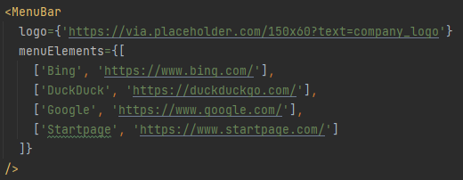

Date: 24.08.2022 - work in progress. This component is not yet complete. No mobile version or scaling.

## Simple menu bar that stays on top of the screen

### This component accepts two props:

**logo**

It should be link for logo file (jpg/png/webp).

example: `logo={'https://via.placeholder.com/150x60?text=company_logo'}`

**menuElements**

It should be array of several arrays that hold data to link destination.

exmaple: `menuElements={[['Bing', 'https://www.bing.com/'], ['DuckDuck', 'https://duckduckgo.com/']]}`

---

Below pictre represents how component should be configured:

